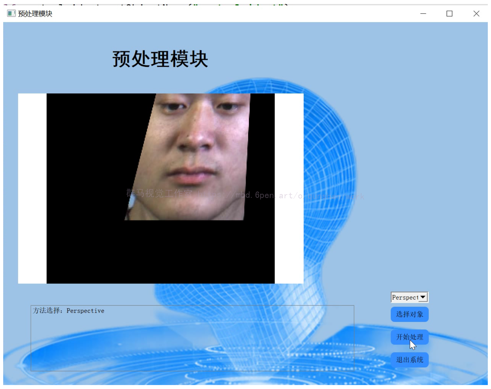
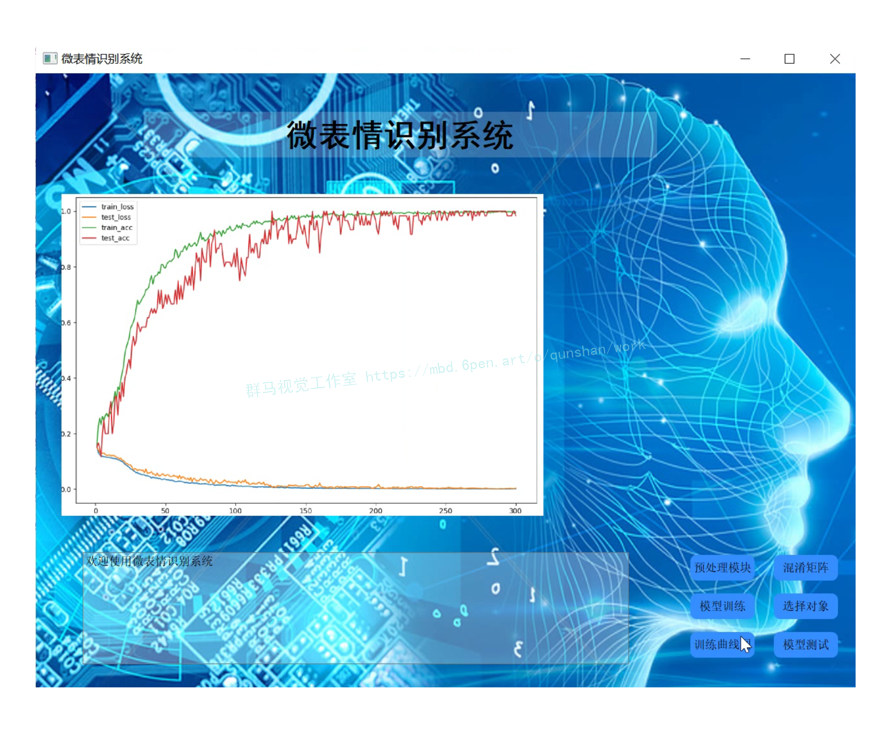

# 1.研究背景
微表情是人类在试图掩饰自己情感时所产生的面部细微变化,在测谎、安防、心理学治疗和微表情识别机器人等方面有着非常广泛的应用,因此微表情识别也开始得到重视.从微表情识别的主流的方法:卷积神经网络及其改进、光流法及其改进、局部二值模式及其改进方法进行分析,对现存的几种方法从使用的算法、准确率、各方法的优缺点、各方法的特点等几个角度进行对比总结;阐述微表情识别目前存在的问题,并对未来的发展方向进行展望。

# 2.图片演示

# 3.视频演示
[基于改进mobilevitv3的微表情识别系统（源码＆教程）_哔哩哔哩_bilibili](https://www.bilibili.com/video/BV1aG4y1T7dM/?vd_source=bc9aec86d164b67a7004b996143742dc)

# 4.基本流程图

本文重点介绍图像预处理、微表情检测与特征提取、微表情分类中所采用的算法，总结目前存在的微表情数据库、微表情识别的重要应用及其展望。

# 5.CASMEⅡ数据集

CASME（Chinese Academy of Sciences Micro-Expression）数据库是2013年由中国科学院心理研究所的傅小兰团队设计获得的。该数据库包含35个受试者（13个女性，22个男性）的195段为表情视频。傅小兰团队总结了 Ekman 发表的表情诱发方法，使用了17段能诱发情感如“厌恶”、“压抑”、“惊讶”、“紧张”的视频短片，并要求受试者抑制自己的表情，微表情的整个过程由一个60帧每秒的摄像机拍摄。所获得的微表情样本进行了AUs编码，包括开始（onset）、顶点（apex）、和释放（offset）三个部分。

[外链图片转存失败,源站可能有防盗链机制,建议将图片保存下来直接上传(img-lx9b795n-1675585628383)(//upload-images.jianshu.io/upload_images/1117456-c4082e50a5bef6af.png?imageMogr2/auto-orient/strip|imageView2/2/w/919/format/webp)]

2014年，傅小兰团队设计了 CASME2 数据库，是CASME数据库的升级版本。新数据库的时间分辨率从原来的60帧每秒变为200帧每秒，空间分辨率也有所增加，在人脸部分已经能达到280*340了。二代数据库在严格的实验环境和适当的光照条件下获得，最终得到247个微表情片段。 

#### 该 CASME II 数据集有五大特征：

（1）该数据集是自发的和动态的微表达；
（2）具有较高的时间分辨率（200 fps）和较高的面部分辨率（280*340像素）；
（3）微表达标签基于FACS研究手册和Yan等人的探寻得到的；
（4）录视频时具有适当的照明，面部上的高光区域减少，没有多余的噪声；
（5）不同分类微表情数据量不均等，由于实验采集难度高。

# 6.基于深度学习的特征提取方法
深度学习来源于人工神经网络，本质上是建立和模拟人类大脑进行分析学习的神经网络。
Hubel 在研究猫咪视觉皮层系统时首次提出感受野的概念，并发现了视觉皮层通路中对于信息的分层处理机制。 Fukushima 等在感受野的基础上提出了神经认知机（Neocognitron)，这可以看作是卷 积 神 经 网 络 的第一次实现。 LeCun 等在研究手写数字识别问题时，提出了利用梯度反向传播算法训练的卷积神经网络模型，取得了优于当时其他方法的效果。 杨雪提出了一种基于 CNN 的微表情特征提取算法，该算法采用的 CNN 架构对人脸眼角、嘴角等位置激活了更多节点，从而能够学习到更高表现力的微表情特征，提高识别率。 尽管CNN 已经能够从面部微表情图像中学到特征，但是它未能将时间因素考虑进去，导致识别率不高。 因此，近几年部分研究人员利用考虑了时间因素的 3D - CNN 进行微表情特征提取。 杨成将3D - CNN 用于微表情识别，与其他深度学习方法相比较，3D - CNN 能够直接处理微表情图像序列或者微表情视频，并且计算简单，效率相对有所提高。

# 7.微表情分类网络改进
与普通表情一样，微表情也包含了人类的情绪变化。 在一段含有微表情的视频片段中，识别
其包含的情绪，称为微表情的分类任务。
[参考该博客提出了简单有效的方法来融合输入、局部(CNN)和全局(ViT)特征，从而导致Imagenet-1K、ADE20k、PascalVOC和COCO数据集的显著性能改进。](https://afdian.net/item/2dede530a52b11ed97d052540025c377)
对MobileViTv1块进行四个主要更改(对MobileViTv2块进行三更改)，如下图所示。融合块中有三个变化:首先，将3x3卷积层替换为1x1卷积层。其次，将局部表示块和全局表示块的特征融合在一起，而不是将输入表示块和全局表示块融合在一起。第三步，在融合块中加入输入特征，作为生成MobileViT块输出前的最后一步。第四个变化是在局部表示块，将普通的3x3卷积层替换为深度3x3卷积层。这些变化导致MobileViTv1块的参数和FLOPs减少，并允许缩放(增加模型宽度)创建新的MobileViTv3-S, XS和XXS架构。

### [参考该博客](https://mbd.pub/o/bread/Y56bl5dv)提出的四个改进点：
**1.将融合块中的3x3卷积层替换为1x1卷积层:**
在融合中替换3x3卷积层有两个主要动机。首先，融合局部和全局特征，独立于特征图中的其他位置，以简化融合块的学习任务。从概念上讲，3x3卷积层是融合输入特征、全局特征，以及其他位置的输入特征和感受野中的全局特征，这是一个复杂的任务。融合块的目标可以简化，允许它融合输入和全局特征，独立于特征图中的其他位置。为此，在融合中使用1x1卷积层而不是3x3卷积层。其次，是消除了MobileViTv1架构扩展的主要限制之一。将MobileViTv1从XXS扩展到S是通过改变网络宽度并保持深度不变来实现的。改变MobileViTv1块的宽度(输入和输出通道的数量)会导致大量增加参数和flop的数量。例如，如果MobileViTv1块中的输入和输出通道增加了一倍(2x)，则融合块内部到3x3卷积层的输入通道数量增加了4倍，输出通道增加了2倍，因为到3x3卷积层的输入是输入和全局表示块特征的拼接。这将导致MobileViTv1块的参数和FLOPs大量增加。使用1x1卷积层避免了缩放时参数和flop的大幅增加。
**2.局部和全局特征融合:**
在融合层中，来自局部和全局表示块的特征被连接到提出的MobileViTv3块中，而不是输入和全局表示特征。这是因为与输入特征相比，局部表示特征与全局表示特征更密切相关。局部表示块的输出通道略高于输入特征中的通道。这导致输入特征映射到融合块的1x1卷积层的数量增加，但由于3x3卷积层变为1x1卷积层，参数和flop的总数明显少于基线MobileViTv1块。
**3.融合输入特征:**
在融合块的1x1卷积层输出中加入输入特征。ResNet和DenseNet等模型中的残差连接已被证明有助于架构中更深层次的优化。通过将输入特征添加到融合块的输出中，在新的MobileViTv3架构中引入了这种残差连接。该残差连接贡献0.6%的精度增益。
**4.局部表示块的深度卷积层:**
为了进一步减少参数，将局部表示块的3x3卷积层替换为深度3x3卷积层。

# 8.系统整合
[下图完整源码＆环境部署视频教程＆数据集＆自定义UI界面](https://s.xiaocichang.com/s/ed3fad)

参考博客[《基于改进mobilevitv3的微表情识别系统（源码＆教程）》](https://mbd.pub/o/qunma/work)

# 9.参考文献
***
[1][赖振意](https://s.wanfangdata.com.cn/paper?q=%E4%BD%9C%E8%80%85:%22%E8%B5%96%E6%8C%AF%E6%84%8F%22),[陈人和](https://s.wanfangdata.com.cn/paper?q=%E4%BD%9C%E8%80%85:%22%E9%99%88%E4%BA%BA%E5%92%8C%22),[钱育蓉](https://s.wanfangdata.com.cn/paper?q=%E4%BD%9C%E8%80%85:%22%E9%92%B1%E8%82%B2%E8%93%89%22).[结合空洞卷积的CNN实时微表情识别算法](https://d.wanfangdata.com.cn/periodical/jsjyyyj202012053)[J].[计算机应用研究](https://sns.wanfangdata.com.cn/perio/jsjyyyj).2020,(12).DOI:[10.19734/j.issn.1001-3695.2019.07.0273](http://dx.chinadoi.cn/10.19734/j.issn.1001-3695.2019.07.0273).

[2][亢洁](https://s.wanfangdata.com.cn/paper?q=%E4%BD%9C%E8%80%85:%22%E4%BA%A2%E6%B4%81%22),[李思禹](https://s.wanfangdata.com.cn/paper?q=%E4%BD%9C%E8%80%85:%22%E6%9D%8E%E6%80%9D%E7%A6%B9%22).[基于注意力机制的卷积神经网络人脸表情识别](https://d.wanfangdata.com.cn/periodical/xbqgyxyxb202004024)[J].[陕西科技大学学报](https://sns.wanfangdata.com.cn/perio/xbqgyxyxb).2020,(4).

[3][梁正友](https://s.wanfangdata.com.cn/paper?q=%E4%BD%9C%E8%80%85:%22%E6%A2%81%E6%AD%A3%E5%8F%8B%22),[何景琳](https://s.wanfangdata.com.cn/paper?q=%E4%BD%9C%E8%80%85:%22%E4%BD%95%E6%99%AF%E7%90%B3%22),[孙宇](https://s.wanfangdata.com.cn/paper?q=%E4%BD%9C%E8%80%85:%22%E5%AD%99%E5%AE%87%22).[一种用于微表情自动识别的三维卷积神经网络进化方法](https://d.wanfangdata.com.cn/periodical/jsjkx202008036)[J].[计算机科学](https://sns.wanfangdata.com.cn/perio/jsjkx).2020,(8).DOI:[10.11896/jsjkx.190700009](http://dx.chinadoi.cn/10.11896/jsjkx.190700009).

[4][刘汝涵](https://s.wanfangdata.com.cn/paper?q=%E4%BD%9C%E8%80%85:%22%E5%88%98%E6%B1%9D%E6%B6%B5%22),[徐丹](https://s.wanfangdata.com.cn/paper?q=%E4%BD%9C%E8%80%85:%22%E5%BE%90%E4%B8%B9%22).[视频放大和深度学习在微表情识别任务上的应用](https://d.wanfangdata.com.cn/periodical/jsjfzsjytxxxb201909009)[J].[计算机辅助设计与图形学学报](https://sns.wanfangdata.com.cn/perio/jsjfzsjytxxxb).2019,(9).DOI:[10.3724/SP.J.1089.2019.17568](http://dx.chinadoi.cn/10.3724/SP.J.1089.2019.17568).

[5][卢官明](https://s.wanfangdata.com.cn/paper?q=%E4%BD%9C%E8%80%85:%22%E5%8D%A2%E5%AE%98%E6%98%8E%22),[杨成](https://s.wanfangdata.com.cn/paper?q=%E4%BD%9C%E8%80%85:%22%E6%9D%A8%E6%88%90%22),[杨文娟](https://s.wanfangdata.com.cn/paper?q=%E4%BD%9C%E8%80%85:%22%E6%9D%A8%E6%96%87%E5%A8%9F%22),等.[基于LBP-TOP特征的微表情识别](https://d.wanfangdata.com.cn/periodical/njydxyxb201706001)[J].[南京邮电大学学报（自然科学版）](https://sns.wanfangdata.com.cn/perio/njydxyxb).2017,(6).DOI:[10.14132/j.cnki.1673-5439.2017.06.001](http://dx.chinadoi.cn/10.14132/j.cnki.1673-5439.2017.06.001).

[6][申寻兵](https://s.wanfangdata.com.cn/paper?q=%E4%BD%9C%E8%80%85:%22%E7%94%B3%E5%AF%BB%E5%85%B5%22),[隋华杰](https://s.wanfangdata.com.cn/paper?q=%E4%BD%9C%E8%80%85:%22%E9%9A%8B%E5%8D%8E%E6%9D%B0%22),[傅小兰](https://s.wanfangdata.com.cn/paper?q=%E4%BD%9C%E8%80%85:%22%E5%82%85%E5%B0%8F%E5%85%B0%22).[微表情在欺骗检测中的应用](https://d.wanfangdata.com.cn/periodical/xlxdt201702003)[J].[心理科学进展](https://sns.wanfangdata.com.cn/perio/xlxdt).2017,(2).DOI:[10.3724/SP.J.1042.2017.00211](http://dx.chinadoi.cn/10.3724/SP.J.1042.2017.00211).

[7][Xiaohong Li](https://s.wanfangdata.com.cn/paper?q=%E4%BD%9C%E8%80%85:%22Xiaohong%20Li%22),[Jun Yu](https://s.wanfangdata.com.cn/paper?q=%E4%BD%9C%E8%80%85:%22Jun%20Yu%22),[Shu Zhan](https://s.wanfangdata.com.cn/paper?q=%E4%BD%9C%E8%80%85:%22Shu%20Zhan%22).Spontaneous facial micro-expression detection based on deep learning[C].2016.

[8][Qiuyu Li](https://s.wanfangdata.com.cn/paper?q=%E4%BD%9C%E8%80%85:%22Qiuyu%20Li%22),[Shu Zhan](https://s.wanfangdata.com.cn/paper?q=%E4%BD%9C%E8%80%85:%22Shu%20Zhan%22),[Liangfeng Xu](https://s.wanfangdata.com.cn/paper?q=%E4%BD%9C%E8%80%85:%22Liangfeng%20Xu%22),等.Facial micro-expression recognition based on the fusion of deep learning and enhanced optical flow[J].Multimedia tools & applications.2019,78(20).29307-29322.DOI:[10.1007/s11042-018-6857-9](http://dx.chinadoi.cn/10.1007/s11042-018-6857-9).

[9][Feng Xu](https://s.wanfangdata.com.cn/paper?q=%E4%BD%9C%E8%80%85:%22Feng%20Xu%22),[Junping Zhang](https://s.wanfangdata.com.cn/paper?q=%E4%BD%9C%E8%80%85:%22Junping%20Zhang%22),[James Z. Wang](https://s.wanfangdata.com.cn/paper?q=%E4%BD%9C%E8%80%85:%22James%20Z.%20Wang%22).Microexpression Identification and Categorization Using a Facial Dynamics Map[J].IEEE transactions on affective computing.2017,8(2).254-267.DOI:[10.1109/TAFFC.2016.2518162](http://dx.chinadoi.cn/10.1109/TAFFC.2016.2518162).

[10][Min, Peng](https://s.wanfangdata.com.cn/paper?q=%E4%BD%9C%E8%80%85:%22Min%2C%20Peng%22),[Chongyang, Wang](https://s.wanfangdata.com.cn/paper?q=%E4%BD%9C%E8%80%85:%22Chongyang%2C%20Wang%22),[Tong, Chen](https://s.wanfangdata.com.cn/paper?q=%E4%BD%9C%E8%80%85:%22Tong%2C%20Chen%22),等.Dual Temporal Scale Convolutional Neural Network for Micro-Expression Recognition.[J].Frontiers in Psychology.2017,8(Spec ).1745.

---
#### 如果您需要更详细的【源码和环境部署教程】，除了通过【系统整合】小节的链接获取之外，还可以通过邮箱以下途径获取:
#### 1.请先在GitHub上为该项目点赞（Star），编辑一封邮件，附上点赞的截图、项目的中文描述概述（About）以及您的用途需求，发送到我们的邮箱
#### sharecode@yeah.net
#### 2.我们收到邮件后会定期根据邮件的接收顺序将【完整源码和环境部署教程】发送到您的邮箱。
#### 【免责声明】本文来源于用户投稿，如果侵犯任何第三方的合法权益，可通过邮箱联系删除。